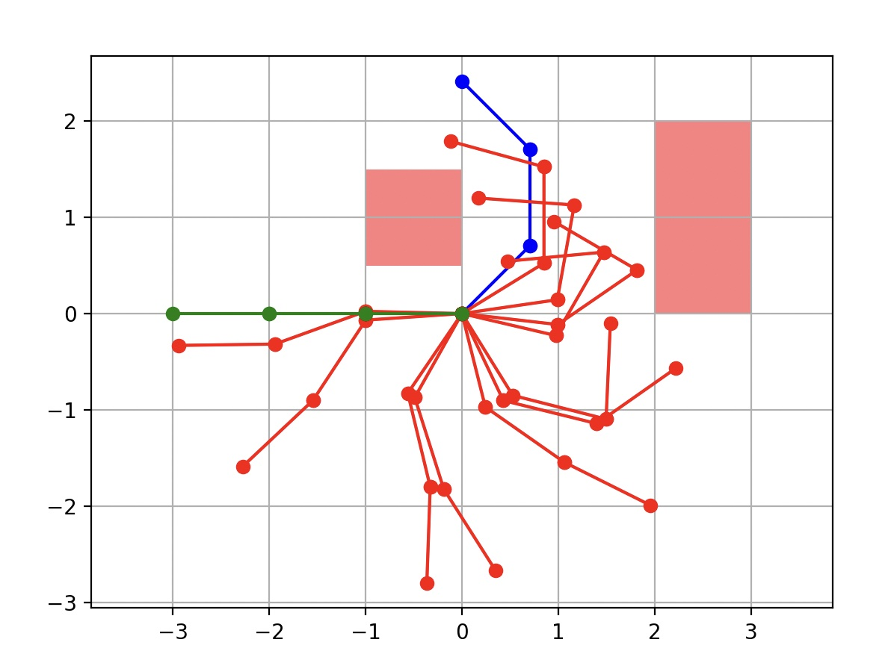
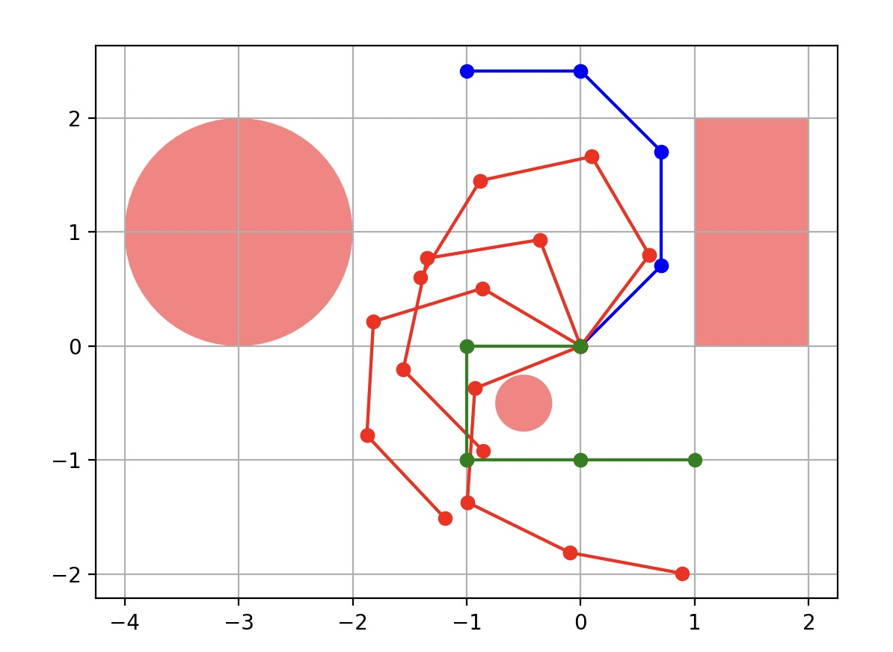
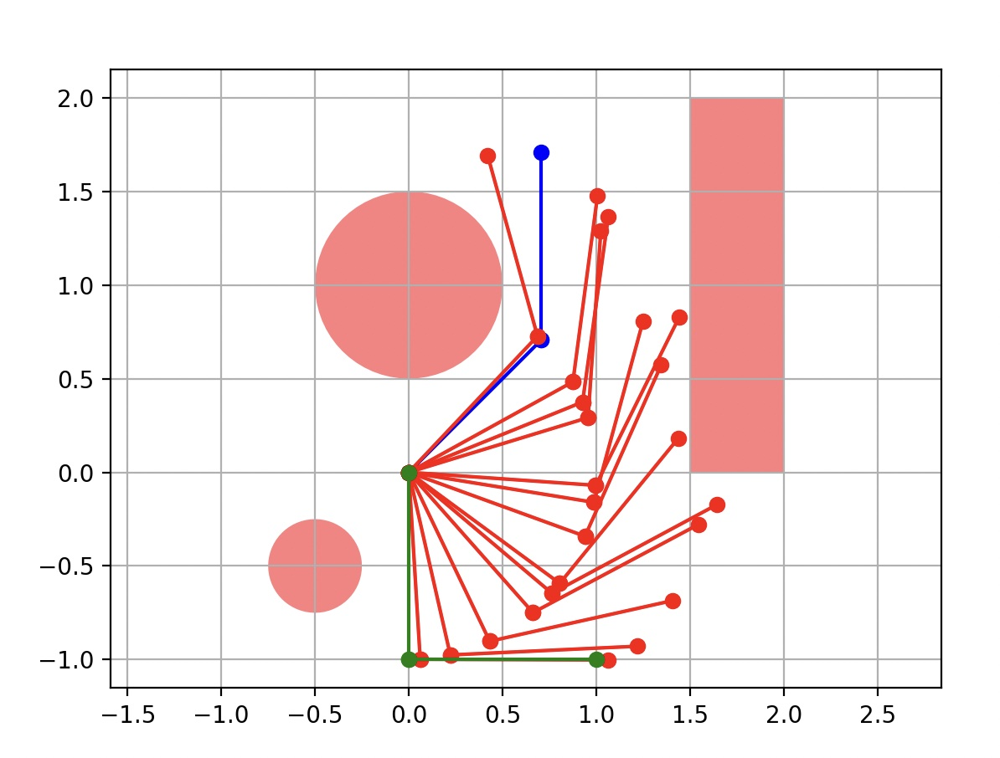

# Robot Motion Planning

## Introduction

One of the most practical uses of artificial intelligence is how we can engineer robots to learn to carry out tasks for us. At the basis of this problem is making sure they can properly move and navigate through our world. In this project, I use a probabilistic roadmap (PRM) to help a robot arm bend its joints in such a way that it can move from a start to goal state around certain obstacles. 

## Implementation

### Kinematics

For testing purposes, this project is centered around the angles of each part of the arm. So in order to find physical points given angles and line lengths of 1 unit, there needs to be some computation using sin and cos. The following code returns a list of all the points on an arm, no matter how many pieces of the arm there are (for the purposes of this project we stick with 2R, 3R, and 4R planar arms):

    def compute_end_points(angles, link_lengths):
        x, y = 0, 0
        points = [(x, y)]
        theta = 0

        for i in range(len(angles)):
            theta += angles[i]
            x += link_lengths[i] * np.cos(theta)
            y += link_lengths[i] * np.sin(theta)
            points.append((x, y))

        return points

Furthermore, it is important to be able to calculate the angular distance between two angles on our unit circle. This requires a little bit of extra work because we consider 0 and 2pi as the same angle. The following code makes up for this issue by considering the min distance between the two possible directions to rotate:

    def angular_distance(a1, a2):
        p = abs(a1 - a2) % (math.pi * 2)
        return min(p, (math.pi * 2) - p)

With these physical properties set up, we now have the ability to begin the first phase of our probabilistic roadmap: graph building.

### Roadmap Generation

To begin searching for an optimal path of configurations for the robot arm, we must first generate a graph of possible positions the arm can even be in. This is where our first independent variable comes in: num_samples. Given an integer input, this will represent the number of possible random configurations we would like to consider for our graph. Using this value, I first randomly generate that many vertices using the following function which gets n random angle values for some n number of segments on the arm:

    def sample_configurations(space_bounds, num_samples, obstacles, link_lengths):
    configurations = []

    for i in range(num_samples):
        # get random angles
        configuration = [np.random.uniform(low, high) for low, high in space_bounds]

        # check for collision
        if not check_collision(configuration, obstacles, link_lengths):
            configurations.append(configuration)

    return configurations

I check for collisions simply by using the shapely library, which I will explain more in detail in a further section.

After my PRM function calls sample_configurations and creates the vertex list, I then have to add the edges to my graph. To do so, I introduce another independent variable k that determines how many neighbors we want to connect to each vertex. Thus, k represents the out-degree of all num_samples vertices, so our graph will have k * num_samples edges. To make the edges I find the k closest vertices under a certain heuristic. The heuristic I have chosen to use is a simple summation of the angular distances for each segment of the arm. The function that finds the k closest vertices is the following:

    def connect_vertices(vertex, vertices, k):
        distances = [sum([angular_distance(vertex[i], v[i]) for i in range(len(vertex))]) for v in vertices]
        sorted_indices = np.argsort(distances)
        return sorted_indices[1:k + 1]  # exclude the first index as it is the vertex itself

My PRM function uses the following loop to then generate the edges:

    for i, vertex in enumerate(vertices):
        neighbors_indices = connect_vertices(vertex, vertices, k)
        for ni in neighbors_indices:
            edges[i].append(ni)
            edges[ni].append(i)  # For undirected graph

With the graph now created, we can begin searching for optimal solutions between a start and goal configuration.

### Query Phase - A* Search

In order to find an optimal path, I use the A* search algorithm. In order to implement this into this project, it requires I create RobotPlanningProblem.py and RobotPlanningSolution.py, which my astar.py can then operate over. In the PRM function, I assign all of the information about our robot and graph into a RobotPlanningProblem class. Because A* search requires a heuristic, get_successors, and goal_test, I have included these three methods in this file. I reuse the same summation of angular distances as the heuristic for my search, simply extract all neighbors to get successors, and check if the passed state matches the goal state for my goal test.

    def heuristic_fn(self, state):
        return sum([angular_distance(state[i], self.goal_state[i]) for i in range(len(state))])

    def get_successors(self, state):
        index = self.state_to_index[state]
        return [tuple(self.vertices[i]) for i in self.edges[index]]

    def is_goal(self, state):
        return self.goal_state == state

Now, the A* algorithm has all the requirements to begin properly searching for a solution path.

### Testing, Shapelylib, and Matplotlib 

With all of the computational work complete, I begin to implement the two mentioned libraries so we can visualize solutions and incorporate obstacles. I have created three tests, one for each the 2R, 3R and 4R planar arms by giving a start and end goal of angles and creating obstacles in between paths. The code I use to draw the arms and graph is from the Matplotlib and looks as follows:

    def draw_robot_arm(points, color):
    for i in range(len(points) - 1):
        plt.plot([points[i][0], points[i+1][0]], [points[i][1], points[i+1][1]], color)

    def show_plot():
        plt.axis('equal')
        plt.grid(True)
        plt.show()

After creating the obstacles with shapely for each test, it is necessary to implement the collision_test into our PRM. The following code uses the shapely library to check each segment of the arm for a collision given a list of angles:

    def check_collision(arm_angles, obstacles, link_lengths):
    # convert to points
    arm_points = compute_end_points(arm_angles, link_lengths)
    arm_line = LineString(arm_points)

    # check for each obstacle
    for obstacle in obstacles:
        if arm_line.intersects(obstacle):
            return True

    return False

Now for the results. It is important to note that not all runs of each test generate an accurate solution due to the nature of the graph. This is where altering our independent variables becomes important which I will discuss later. A majority of the time with my selection of k and num_samples, my tests generate a correct solution, but changing them may cause some miscalculations. For the visualizations, the blue arm represents the start configuration and the green arm represents the goal.

The first test I created with a 3R planar arm navigates around two rectangles. Notice how even though the heuristic might urge the arm to rotate counterclockwise, because the rectangle is in the way, it quickly figures out it needs to squeeze through clockwise. For this test, I used 1000 samples with k = 4. The result shows many configurations in the path.

The second test was on the 4R planar arm which requires that it contracts and rotates in order to configure itself around a small circle. For this test, I use 2000 samples with k = 4. This result shows fewer configurations because it was easier for it to find the solution. 

The third test was on the 2R planar arm which requires a tight rotation in front of a rectange so it can reach the bottom of the graph. For this test, I use 2000 samples with k = 6 so we can see the movements more closely. 

## Discussion

From the tests, it is clear that the heuristics and independent variables I have used work, but it is important to consider how changing them might be important for different kinds of tests. Another heuristic that one might consider using is the Euclidean distance between the end point of the current configuration and the end configuration. Though this approach may be more useful in scenarious where the target is a straight shot from the start through the obstacles, I find that the angular distance heuristic I chose works for more scenarios. 

For the choice of independent variables, each has a different meaning. Our choice of num_samples will result in how dense the graph we create is. The higher the number, the more dense. This allows for more thorough solutions with less likelihood of making a mistake at the cost of efficiency. 

Our choice of k results in how many neighbors A* will consider for each vertex in the path. This means there are more options to choose from that might be a further distance away if a higher k is chosen, which could shorten the number of configurations in the path. At a low density, it is important to keep k low as well so mistakes aren't made such as the arm jumping over an obstacle. Essentially, increasing k improves at the cost of accuarcy.

## Conclusion

Now that we have demonstrated how artificial intelligence can work to help in the motion of a robotic arm, there are so many more possibilities available in the field of artificial intelligence in robotics. Together they can lead to revolutionary inventions in our near future.
